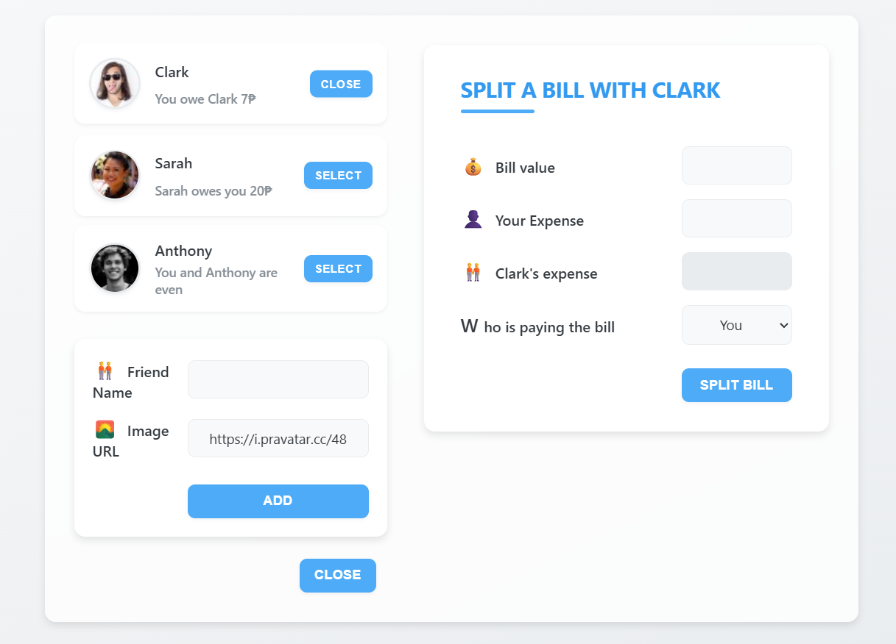
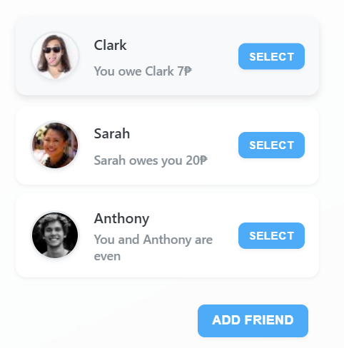
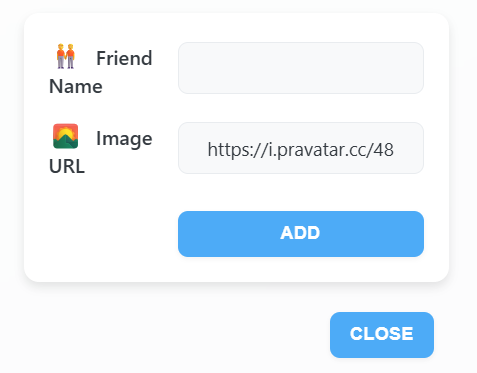
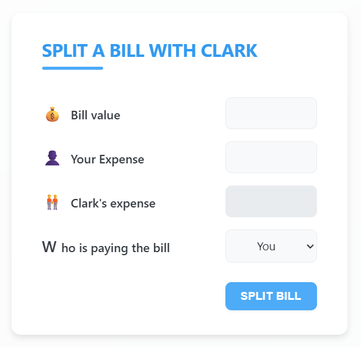

# 🍽️ Split Restaurant Bill - React Component

A modern, interactive React application for splitting restaurant bills among friends with a beautiful glass-morphism design. Perfect for group dining scenarios where you need to track who owes what and calculate fair bill splits.



## ✨ Features

- **Friend Management**: Add, remove, and manage your dining companions
- **Dynamic Balance Tracking**: Real-time display of who owes money and to whom
- **Smart Bill Splitting**: Calculate bill splits with custom expense allocation
- **Beautiful UI**: Modern glass-morphism design with smooth animations
- **Responsive Design**: Works seamlessly on desktop and mobile devices
- **Persistent State**: Maintains friend list and balances during the session
- **Currency Support**: Displays amounts in Philippine Peso (₱) format

## 🎯 Screenshots

### Main Interface


_The main dashboard showing friend list and split bill form_

### Friends List


_Manage your friends with balance indicators_

### Add Friend


_Simple form to add new friends to your list_

### Split Bill


_Calculate and split bills with selected friends_

## 🚀 Quick Start

### Prerequisites

- Node.js (v14 or higher)
- npm or yarn package manager

### Installation

1. **Clone the repository**

   ```bash
   git clone <repository-url>
   cd split-resto-bill
   ```

2. **Install dependencies**

   ```bash
   npm install
   ```

3. **Start the development server**

   ```bash
   npm start
   ```

4. **Open your browser**
   Navigate to [http://localhost:3000](http://localhost:3000)

## 📁 Project Structure

```
split-resto-bill/
├── public/
│   ├── AddFriend.png
│   ├── FriendList.png
│   ├── Main.png
│   ├── SplitBill.png
│   ├── index.html
│   ├── manifest.json
│   └── robots.txt
├── src/
│   ├── App.js                 # Main application component
│   ├── index.css              # Global styles and design system
│   └── index.js               # React app entry point
├── package.json
└── README.md
```

## 🎨 Design System

The application uses a carefully crafted design system with CSS custom properties:

- **Glass-morphism Effect**: Semi-transparent backgrounds with backdrop blur
- **Color Palette**: Blue-based color scheme with success/error indicators
- **Typography**: Inter font family for modern readability
- **Shadows**: Layered shadow system for depth
- **Animations**: Smooth transitions and hover effects
- **Responsive Grid**: CSS Grid layout for optimal viewing on all devices

## 🔧 Component Architecture

### Core Components

1. **App Component** - Main application state management
2. **FriendsList** - Displays all friends with their balances
3. **Friend** - Individual friend item with selection capability
4. **FormAddFriend** - Form for adding new friends
5. **FormSplitBill** - Form for splitting bills with calculations
6. **Button** - Reusable button component with consistent styling

### State Management

The application uses React's `useState` hook for state management:

- `friends`: Array of friend objects with id, name, image, and balance
- `showAddFriend`: Boolean to toggle add friend form visibility
- `selectedFriend`: Currently selected friend for bill splitting

## 💡 Usage Guide

### Adding Friends

1. Click the "Add Friend" button
2. Enter friend's name and optional image URL
3. Click "Add" to save the friend
4. The friend appears in the list with zero balance

### Splitting Bills

1. Select a friend from the list by clicking "Select"
2. Enter the total bill amount
3. Specify your expense amount
4. Choose who is paying the bill
5. Click "Split Bill" to calculate and update balances

### Balance Interpretation

- **Green text**: Friend owes you money
- **Red text**: You owe the friend money
- **Regular text**: You're even with the friend

## 🛠️ Integration Guide

### Adding to Existing React Project

1. **Copy the component files**

   ```bash
   # Copy the main component
   cp src/App.js your-project/src/components/SplitBill.js

   # Copy the styles
   cp src/index.css your-project/src/styles/split-bill.css
   ```

2. **Install dependencies** (if not already present)

   ```bash
   npm install react react-dom
   ```

3. **Import and use the component**

   ```jsx
   import SplitBill from "./components/SplitBill";
   import "./styles/split-bill.css";

   function App() {
     return (
       <div className="App">
         <SplitBill />
       </div>
     );
   }
   ```

### Customization Options

#### Styling Customization

Modify CSS custom properties in `index.css`:

```css
:root {
  --color-medium: #your-primary-color;
  --color-dark: #your-secondary-color;
  --color-success: #your-success-color;
  --color-error: #your-error-color;
}
```

#### Currency Customization

Change currency symbol in `App.js`:

```javascript
// Replace ₱ with your preferred currency symbol
<p className="red">
  You owe {friend.name} {Math.abs(friend.balance)}$
</p>
```

#### Initial Friends Data

Modify `initialFriends` array in `App.js`:

```javascript
const initialFriends = [
  {
    id: 1,
    name: "Your Friend",
    image: "https://i.pravatar.cc/48?u=1",
    balance: 0,
  },
  // Add more friends...
];
```

## 🧪 Available Scripts

### Development

```bash
npm start          # Start development server
npm test           # Run test suite
npm run build      # Build for production
npm run eject      # Eject from Create React App
```

### Production Build

```bash
npm run build      # Creates optimized production build
```

## 📱 Responsive Design

The application is fully responsive with breakpoints:

- **Desktop**: Grid layout with sidebar and main content
- **Tablet** (< 900px): Single column layout
- **Mobile** (< 600px): Optimized spacing and typography

## 🎯 Key Features Implementation

### Bill Splitting Logic

```javascript
// Positive balance: Friend owes you
// Negative balance: You owe friend
// Zero balance: Even

const calculateSplit = (paidByUser, totalBill, whoIsPaying) => {
  const paidByFriend = totalBill - paidByUser;
  return whoIsPaying === "user" ? paidByFriend : -paidByUser;
};
```

### Friend Selection Management

```javascript
// Toggle selection (deselect if already selected)
const handleSelection = (friend) => {
  setSelectedFriend((current) => (current?.id === friend.id ? null : friend));
};
```

---

**Happy bill splitting! 🍽️💰**
